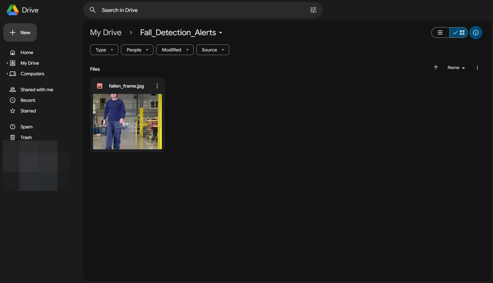

# Installing Libraries
```python
!pip install ultralytics torch torchvision opencv-python mediapipe numpy matplotlib tqdm twilio
"""
- ultralytics: Provides easy-to-use YOLO implementations for object detection and classification tasks.
- torch: PyTorch library for building and training neural networks.
- torchvision: Useful for image processing, data transformations, and handling pre-trained models.
- opencv-python: OpenCV library for image and video processing (e.g., extracting video frames).
- mediapipe: Google's library for real-time keypoint and pose estimation (e.g., extracting pose data).
- numpy: Essential for numerical operations and handling keypoints as arrays.
- matplotlib: For visualizing pose keypoints, graphs, or training metrics.
- tqdm: Displays progress bars to monitor loops like model training or data preprocessing.
- twilio: Allows sending SMS or email notifications for alerts or updates (e.g., fall detection results or training completion).
"""
```

# Mounting the Google Drive

```python
# Mount Drive to load dataset
from google.colab import drive
drive.mount('/content/drive')
```

# Creating Keypoints & Labels for Training Dataset

## Function

```python
import mediapipe as mp
import numpy as np
import cv2
import os

def extract_keypoints_and_labels(image_folder, output_keypoints_path, output_labels_path):
    """
    Extracts pose keypoints and labels from images.
    Args:
        image_folder (str): Path to the folder containing images.
        output_keypoints_path (str): Path to save the keypoints numpy file.
        output_labels_path (str): Path to save the labels numpy file.
    """
    mp_pose = mp.solutions.pose
    pose = mp_pose.Pose(static_image_mode=True)
    keypoints_list = []
    labels_list = []

    for image_name in os.listdir(image_folder):
        if image_name.endswith('.jpg') or image_name.endswith('.png'):
            image_path = os.path.join(image_folder, image_name)
            label = 1 if 'fallen' in image_name.lower() else 0

            image = cv2.imread(image_path)
            image_rgb = cv2.cvtColor(image, cv2.COLOR_BGR2RGB)
            results = pose.process(image_rgb)

            if results.pose_landmarks:
                keypoints = [
                    [lm.x, lm.y, lm.z]
                    for lm in results.pose_landmarks.landmark
                ]
            else:
                # If no pose is detected, add zeros
                keypoints = [[0, 0, 0] for _ in range(33)]

            keypoints_list.append(keypoints)
            labels_list.append(label)

    pose.close()

    # Save keypoints and labels as numpy arrays
    keypoints_array = np.array(keypoints_list)
    labels_array = np.array(labels_list)
    np.save(output_keypoints_path, keypoints_array)
    np.save(output_labels_path, labels_array)
    print(f"Keypoints saved to {output_keypoints_path}")
    print(f"Labels saved to {output_labels_path}")
```

## Execution

```python
# Paths to your datasets
train_images_path = '/content/drive/MyDrive/STGCN_Dataset/images/train'
validation_images_path = '/content/drive/MyDrive/STGCN_Dataset/images/validation'

# Output paths for keypoints and labels
train_keypoints_path = '/content/drive/MyDrive/STGCN_Dataset/train_keypoints.npy'
train_labels_path = '/content/drive/MyDrive/STGCN_Dataset/train_labels.npy'
validation_keypoints_path = '/content/drive/MyDrive/STGCN_Dataset/validation_keypoints.npy'
validation_labels_path = '/content/drive/MyDrive/STGCN_Dataset/validation_labels.npy'

# Extract keypoints and labels for train and validation datasets
extract_keypoints_and_labels(train_images_path, train_keypoints_path, train_labels_path)
extract_keypoints_and_labels(validation_images_path, validation_keypoints_path, validation_labels_path)

# Verify train keypoints and labels
train_keypoints = np.load(train_keypoints_path)
train_labels = np.load(train_labels_path)
print("Train Keypoints Shape:", train_keypoints.shape)
print("Train Labels Shape:", train_labels.shape)

# Verify validation keypoints and labels
validation_keypoints = np.load(validation_keypoints_path)
validation_labels = np.load(validation_labels_path)
print("Validation Keypoints Shape:", validation_keypoints.shape)
print("Validation Labels Shape:", validation_labels.shape)
```

## Output
```
Mounted at /content/drive
Keypoints saved to /content/drive/MyDrive/STGCN_Dataset/train_keypoints.npy
Labels saved to /content/drive/MyDrive/STGCN_Dataset/train_labels.npy
Keypoints saved to /content/drive/MyDrive/STGCN_Dataset/validation_keypoints.npy
Labels saved to /content/drive/MyDrive/STGCN_Dataset/validation_labels.npy
Train Keypoints Shape: (332, 33, 3)
Train Labels Shape: (332,)
Validation Keypoints Shape: (86, 33, 3)
Validation Labels Shape: (86,)
```

# STGCN Model Definition

```python
import torch
import torch.nn as nn
from torch.utils.data import Dataset, DataLoader

# Define the STGCN layer
class STGCNLayer(nn.Module):
    """
    A single Spatio-Temporal Graph Convolutional Network (ST-GCN) layer.
    This layer performs spatial and temporal convolutions on the input data.

    Args:
        in_channels (int): Number of input channels (features per keypoint).
        out_channels (int): Number of output channels (features).
        kernel_size_spatial (int): Kernel size for the spatial convolution.
        kernel_size_temporal (int): Kernel size for the temporal convolution.
    """
    def __init__(self, in_channels, out_channels, kernel_size_spatial=25, kernel_size_temporal=3):
        super(STGCNLayer, self).__init__()
        self.spatial_conv = nn.Conv2d(in_channels, out_channels, kernel_size=(1, kernel_size_spatial), padding=(0, kernel_size_spatial // 2))
        self.temporal_conv = nn.Conv2d(out_channels, out_channels, kernel_size=(kernel_size_temporal, 1), padding=(kernel_size_temporal // 2))
        self.bn = nn.BatchNorm2d(out_channels)

    def forward(self, x):
        """
        Forward pass through the STGCN layer.

        Args:
            x (torch.Tensor): Input tensor with shape (batch_size, in_channels, num_frames, num_keypoints).

        Returns:
            torch.Tensor: Output tensor after spatial and temporal convolutions.
        """
        x = self.spatial_conv(x)  # Spatial convolution
        x = torch.relu(x)
        x = self.temporal_conv(x)  # Temporal convolution
        x = self.bn(torch.relu(x))  # Batch normalization
        return x

# Define the full STGCN model
class STGCN(nn.Module):
    """
    The full Spatio-Temporal Graph Convolutional Network (ST-GCN) model.

    Args:
        num_keypoints (int): Number of keypoints in the pose data.
        num_classes (int): Number of classes for the classification task.
    """
    def __init__(self, num_keypoints, num_classes):
        super(STGCN, self).__init__()
        self.stgcn1 = STGCNLayer(1, 64, num_keypoints)  # Change input channels to 1
        self.stgcn2 = STGCNLayer(64, 64, num_keypoints)
        self.fc = nn.Linear(64, num_classes)

    def forward(self, x):
        """
        Forward pass through the STGCN model.

        Args:
            x (torch.Tensor): Input tensor with shape (batch_size, num_keypoints, num_frames).

        Returns:
            torch.Tensor: Output tensor containing class scores for each input sample.
        """
        if x.dim() == 3:
            x = x.unsqueeze(1)  # Shape becomes (batch_size, 1, num_keypoints, num_frames)

        x = x.permute(0, 1, 3, 2)  # Reorder to (batch_size, in_channels, num_frames, num_keypoints)
        x = self.stgcn1(x)
        x = self.stgcn2(x)
        x = x.mean(dim=[2, 3])  # Global average pooling (across frames and keypoints)
        return self.fc(x)


# Dataset class
class PoseDataset(Dataset):
    """
    A custom PyTorch Dataset for handling pose keypoints and labels.

    Args:
        keypoints (list or numpy.ndarray): List or array containing pose keypoints
                                           with shape (N, num_keypoints, 3).
        labels (list or numpy.ndarray): List or array containing class labels.
    """
    def __init__(self, keypoints, labels):
        self.keypoints = torch.tensor(keypoints, dtype=torch.float32)  # Shape: (N, num_keypoints, 3)
        self.labels = torch.tensor(labels, dtype=torch.long)

    def __len__(self):
        """
        Returns the number of samples in the dataset.

        Returns:
            int: Total number of samples.
        """
        return len(self.labels)

    def __getitem__(self, idx):
        """
        Retrieves the keypoints and label for a given index.

        Args:
            idx (int): Index of the sample to retrieve.

        Returns:
            tuple: A tuple containing the keypoints tensor and the label.
        """
        return self.keypoints[idx], self.labels[idx]
```

# Training the STGCN Model

## Function

```python
from tqdm import tqdm

def train_stgcn(train_keypoints, train_labels, val_keypoints, val_labels, model_path, num_epochs=10, batch_size=16):
    """
    Trains the ST-GCN model for pose classification and validates its performance.

    Args:
        train_keypoints (list or numpy.ndarray): Training keypoints data with shape (num_samples, num_frames, num_keypoints).
        train_labels (list or numpy.ndarray): Training labels corresponding to the keypoints.
        val_keypoints (list or numpy.ndarray): Validation keypoints data with shape (num_samples, num_frames, num_keypoints).
        val_labels (list or numpy.ndarray): Validation labels corresponding to the keypoints.
        model_path (str): Path to save the trained model.
        num_epochs (int): Number of training epochs. Default is 10.
        batch_size (int): Batch size for training and validation. Default is 16.
    """
    # Define the device
    device = torch.device("cuda" if torch.cuda.is_available() else "cpu")

    # Convert inputs to tensors, if not already done
    train_keypoints = torch.tensor(train_keypoints, dtype=torch.float32).to(device)
    train_labels = torch.tensor(train_labels, dtype=torch.int64).to(device)
    val_keypoints = torch.tensor(val_keypoints, dtype=torch.float32).to(device)
    val_labels = torch.tensor(val_labels, dtype=torch.int64).to(device)

    # Create DataLoader
    train_dataset = torch.utils.data.TensorDataset(train_keypoints, train_labels)
    val_dataset = torch.utils.data.TensorDataset(val_keypoints, val_labels)

    train_loader = torch.utils.data.DataLoader(train_dataset, batch_size=batch_size, shuffle=True)
    val_loader = torch.utils.data.DataLoader(val_dataset, batch_size=batch_size, shuffle=False)

    # Initialize the model with correct input channels and output classes
    model = STGCN(num_keypoints=train_keypoints.shape[2], num_classes=2)  # Assuming 33 keypoints and 2 classes
    model = model.to(device)

    # Define Loss and Optimizer
    criterion = nn.CrossEntropyLoss()
    optimizer = torch.optim.Adam(model.parameters(), lr=0.001)

    for epoch in range(num_epochs):
        model.train()
        running_loss = 0.0
        for keypoints, labels in tqdm(train_loader, desc=f"Training Epoch {epoch+1}"):
            keypoints, labels = keypoints.to(device), labels.to(device)
            optimizer.zero_grad()

            # Forward pass
            outputs = model(keypoints)
            loss = criterion(outputs, labels)

            # Backward pass and optimization
            loss.backward()
            optimizer.step()

            running_loss += loss.item()

        avg_train_loss = running_loss / len(train_loader)
        print(f"Epoch [{epoch+1}/{num_epochs}], Loss: {avg_train_loss:.4f}")

        # Validation step
        model.eval()
        correct = 0
        total = 0
        with torch.no_grad():
            for keypoints, labels in val_loader:
                keypoints, labels = keypoints.to(device), labels.to(device)
                outputs = model(keypoints)
                _, predicted = torch.max(outputs, 1)
                total += labels.size(0)
                correct += (predicted == labels).sum().item()

        accuracy = 100 * correct / total
        print(f"Validation Accuracy: {accuracy:.2f}%")

    # Save the trained model
    torch.save(model.state_dict(), model_path)
```

## Execution

```python
import torch

# Load dataset
train_keypoints = np.load('/content/drive/MyDrive/STGCN_Dataset/train_keypoints.npy')
train_labels = np.load('/content/drive/MyDrive/STGCN_Dataset/train_labels.npy')

validation_keypoints = np.load('/content/drive/MyDrive/STGCN_Dataset/validation_keypoints.npy')
validation_labels = np.load('/content/drive/MyDrive/STGCN_Dataset/validation_labels.npy')

# Reshape the keypoints for STGCN
train_keypoints = train_keypoints.transpose(0, 2, 1)  # Shape: (332, 33, 3)
validation_keypoints = validation_keypoints.transpose(0, 2, 1)  # Shape: (86, 33, 3)

# Ensure the shapes and datatypes are correct
# Convert labels from numpy arrays to PyTorch tensors and ensure they are integers
train_labels = torch.tensor(train_labels).long()
val_labels = torch.tensor(validation_labels).long()

print(f"Train Keypoints shape: {train_keypoints.shape}, dtype: {train_keypoints.dtype}")
print(f"Train Labels shape: {train_labels.shape}, dtype: {train_labels.dtype}")
print(f"Validation Keypoints shape: {validation_keypoints.shape}, dtype: {validation_keypoints.dtype}")
print(f"Validation Labels shape: {val_labels.shape}, dtype: {val_labels.dtype}")

# Train STGCN model
model_path = '/content/drive/MyDrive/STGCN_Dataset/stgcn_model.pth'

train_stgcn(train_keypoints, train_labels, validation_keypoints, validation_labels, model_path, num_epochs=10, batch_size=16)
```

## Output
```
Train Keypoints shape: (332, 3, 33), dtype: float64
Train Labels shape: torch.Size([332]), dtype: torch.int64
Validation Keypoints shape: (86, 3, 33), dtype: float64
Validation Labels shape: torch.Size([86]), dtype: torch.int64
<ipython-input-6-a9e432a861e0>:21: UserWarning: To copy construct from a tensor, it is recommended to use sourceTensor.clone().detach() or sourceTensor.clone().detach().requires_grad_(True), rather than torch.tensor(sourceTensor).
  train_labels = torch.tensor(train_labels, dtype=torch.int64).to(device)
<ipython-input-6-a9e432a861e0>:23: UserWarning: To copy construct from a tensor, it is recommended to use sourceTensor.clone().detach() or sourceTensor.clone().detach().requires_grad_(True), rather than torch.tensor(sourceTensor).
  val_labels = torch.tensor(val_labels, dtype=torch.int64).to(device)
Training Epoch 1: 100%|██████████| 21/21 [00:02<00:00,  9.84it/s]
Epoch [1/10], Loss: 0.6077
Validation Accuracy: 52.33%
Training Epoch 2: 100%|██████████| 21/21 [00:03<00:00,  6.91it/s]
Epoch [2/10], Loss: 0.5261
Validation Accuracy: 52.33%
Training Epoch 3: 100%|██████████| 21/21 [00:02<00:00,  7.67it/s]
Epoch [3/10], Loss: 0.4510
Validation Accuracy: 76.74%
Training Epoch 4: 100%|██████████| 21/21 [00:01<00:00, 11.13it/s]
Epoch [4/10], Loss: 0.4213
Validation Accuracy: 76.74%
Training Epoch 5: 100%|██████████| 21/21 [00:01<00:00, 11.09it/s]
Epoch [5/10], Loss: 0.4180
Validation Accuracy: 82.56%
Training Epoch 6: 100%|██████████| 21/21 [00:01<00:00, 11.15it/s]
Epoch [6/10], Loss: 0.3685
Validation Accuracy: 86.05%
Training Epoch 7: 100%|██████████| 21/21 [00:01<00:00, 10.96it/s]
Epoch [7/10], Loss: 0.3458
Validation Accuracy: 83.72%
Training Epoch 8: 100%|██████████| 21/21 [00:02<00:00,  7.99it/s]
Epoch [8/10], Loss: 0.3217
Validation Accuracy: 88.37%
Training Epoch 9: 100%|██████████| 21/21 [00:03<00:00,  6.38it/s]
Epoch [9/10], Loss: 0.3406
Validation Accuracy: 87.21%
Training Epoch 10: 100%|██████████| 21/21 [00:01<00:00, 10.92it/s]
Epoch [10/10], Loss: 0.3247
Validation Accuracy: 82.56%
```

# Prediction

## Function

```python
import torch
import numpy as np
import cv2
import math
from mediapipe import solutions as mp_solutions

# Initialize MediaPipe Pose
mp_pose = mp.solutions.pose
pose_model = mp_pose.Pose(min_detection_confidence=0.5, min_tracking_confidence=0.5)

# ==============================
# Helper Functions for STGCN
# ==============================

def preprocess_for_stgcn(keypoints):
    """
    Preprocesses keypoints for input to the STGCN model by normalizing and reshaping.

    Args:
        keypoints (list or numpy.ndarray): Keypoints as a list or array of (x, y) coordinates.

    Returns:
        numpy.ndarray: Preprocessed keypoints with shape [C, T, V].
    """
    # Normalize keypoints to the range [0, 1] (example)
    keypoints = np.array(keypoints)
    keypoints[:, 0] /= 1920  # Normalize x-coordinates by frame width
    keypoints[:, 1] /= 1080  # Normalize y-coordinates by frame height

    # Add temporal dimension and channel dimension (example shape: [C, T, V])
    keypoints = keypoints.T  # Transpose to get [2, 18]
    keypoints = np.expand_dims(keypoints, axis=1)  # Add temporal dimension: [2, 1, 18]
    return keypoints

def extract_pose_keypoints(frame):
    """
    Extracts and normalizes pose keypoints from a video frame using MediaPipe Pose.

    Args:
        frame (numpy.ndarray): A single video frame.

    Returns:
        list or None: Keypoints if pose landmarks are detected, otherwise None.
    """
    with mp_solutions.pose.Pose(static_image_mode=True, model_complexity=2) as pose:
        results = pose.process(cv2.cvtColor(frame, cv2.COLOR_BGR2RGB))
        if results.pose_landmarks:
            keypoints = results.pose_landmarks.landmark
            return keypoints
        else:
            return None

def classify_pose(landmarks):
    """
    Classifies the pose based on keypoint landmarks and calculated angles.

    Args:
        landmarks (list): Pose keypoints as landmarks from MediaPipe.

    Returns:
        tuple: Pose classification as a string and the torso angle as a float.
    """
    # Extract head, shoulder, and hip keypoints
    head = (landmarks[mp_pose.PoseLandmark.NOSE.value].x, landmarks[mp_pose.PoseLandmark.NOSE.value].y)
    left_shoulder = (landmarks[mp_pose.PoseLandmark.LEFT_SHOULDER.value].x, landmarks[mp_pose.PoseLandmark.LEFT_SHOULDER.value].y)
    right_shoulder = (landmarks[mp_pose.PoseLandmark.RIGHT_SHOULDER.value].x, landmarks[mp_pose.PoseLandmark.RIGHT_SHOULDER.value].y)
    left_hip = (landmarks[mp_pose.PoseLandmark.LEFT_HIP.value].x, landmarks[mp_pose.PoseLandmark.LEFT_HIP.value].y)
    right_hip = (landmarks[mp_pose.PoseLandmark.RIGHT_HIP.value].x, landmarks[mp_pose.PoseLandmark.RIGHT_HIP.value].y)

    # Calculate torso center (midpoint of shoulders and hips)
    shoulder_center = ((left_shoulder[0] + right_shoulder[0]) / 2, (left_shoulder[1] + right_shoulder[1]) / 2)
    hip_center = ((left_hip[0] + right_hip[0]) / 2, (left_hip[1] + right_hip[1]) / 2)

    # Calculate the angle between the head and torso-hip center
    dy = hip_center[1] - head[1]
    dx = hip_center[0] - head[0]
    torso_angle = math.atan2(dy, dx)

    if torso_angle > 1:
        #print(f"Standing detected: Torso angle = {torso_angle:.2f}")
        return "Standing", torso_angle
    elif torso_angle < 1:
        #print(f"Lying Down detected: Torso angle = {torso_angle:.2f}")
        return "Lying Down", torso_angle
    else:
        #print(f"Sitting detected: Torso angle = {torso_angle:.2f}")
        return "Sitting", torso_angle


# ==============================
# Sliding Window Logic
# ==============================

# Function to analyze a window of frames for fall detection
def process_frame_window(frames, pose_dict):
    transition_found = False
    for i in range(1, len(frames)):
        prev_pose = pose_dict.get(i-1, "")
        curr_pose = pose_dict.get(i, "")

        # Detect transition from "Sitting" or "Standing" to "Lying Down"
        #print(f"Frame {i}: Previous pose = {prev_pose}, Current pose = {curr_pose}")
        if (prev_pose in ["Sitting", "Standing"] and curr_pose == "Lying Down"):
            print(f"Transition detected from {prev_pose} to {curr_pose} at frame {i}")
            transition_found = True
            break

    return 'Fall Detected' if transition_found else 'No Fall Detected'

# ==============================
# Prediction Function
# ==============================

def predict_with_fallback(video_path, stgcn_model, device, frame_skip=1):
    """
    Predicts fall occurrences in a video using STGCN and falls back to MediaPipe on errors.

    Args:
        video_path (str): Path to the input video file.
        stgcn_model (torch.nn.Module): Trained STGCN model for pose classification.
        device (torch.device): Device for PyTorch model inference.
        frame_skip (int): Number of frames to skip between predictions. Default is 1.

    Returns:
        dict: Results containing frame-wise predictions, overall result, and output video path.
    """
    cap = cv2.VideoCapture(video_path)
    fps = int(cap.get(cv2.CAP_PROP_FPS))
    width = int(cap.get(cv2.CAP_PROP_FRAME_WIDTH))
    height = int(cap.get(cv2.CAP_PROP_FRAME_HEIGHT))
    out = cv2.VideoWriter('output_annotated.mp4', cv2.VideoWriter_fourcc(*'mp4v'), fps, (width, height))

    frame_count, fall_detected, use_fallback = 0, False, False  # `use_fallback` to manage fallback logic
    window_size = 100  # Sliding window size

    frames, keypoints_sequence = [], []
    pose_dict = {}  # Store frame-wise pose predictions

    print(f"Processing video with STGCN and MediaPipe fallback: {video_path}")

    while cap.isOpened():
        ret, frame = cap.read()
        if not ret:
            break

        if frame_count % frame_skip == 0:
            # STGCN Model Prediction
            if not use_fallback:
                try:
                    keypoints = extract_pose_keypoints(frame)
                    stgcn_input = preprocess_for_stgcn(keypoints)

                    stgcn_model.eval()
                    stgcn_input = torch.tensor(stgcn_input, dtype=torch.float32).unsqueeze(0).to(device)
                    prediction = stgcn_model(stgcn_input)
                    predicted_class = torch.argmax(prediction, dim=1).item()

                    if predicted_class == 3:  # Assuming "Fallen" is class 3
                        fall_detected = True
                        print(f"STGCN detected fall at frame {frame_count}.")
                        break

                except Exception as e:
                    print(f"STGCN prediction error: {e}. Falling back to MediaPipe.")
                    use_fallback = True  # Trigger fallback to MediaPipe

            if use_fallback:
                landmarks = extract_pose_keypoints(frame)
                if landmarks:
                    pose, torso_angle = classify_pose(landmarks)
                    pose_dict[frame_count] = pose
                    cv2.putText(frame, f"Pose: {pose}", (50, 50), cv2.FONT_HERSHEY_SIMPLEX, 1, (0, 255, 0), 2)
                    cv2.putText(frame, f"Torso Angle: {torso_angle:.2f}", (50, 100), cv2.FONT_HERSHEY_SIMPLEX, 1, (255, 0, 0), 2)

                    frames.append(frame)
                    keypoints = np.array([[lm.x, lm.y, lm.z, lm.visibility] for lm in landmarks])
                    keypoints_sequence.append(keypoints)

                    if len(frames) == window_size:
                        window_result = process_frame_window(frames, pose_dict)
                        if window_result == 'Fall Detected':
                            print(f"Confirmed fall detected at frame {frame_count} using MediaPipe.")
                            fall_detected = True  # Confirm the fall based on MediaPipe processing
                            break
                        frames.pop(0)
                        keypoints_sequence.pop(0)
                else:
                    pose_dict[frame_count] = "No Person Detected"
                    cv2.putText(frame, "No Person Detected", (50, 50), cv2.FONT_HERSHEY_SIMPLEX, 1, (0, 0, 255), 2)

        out.write(frame)
        frame_count += 1

    cap.release()
    out.release()

    result = "Fall Detected" if fall_detected else "No Fall Detected"
    print(f"Video processing complete. Fall Detection Result: {result}")
    return {
        "Frame Results": pose_dict,
        "Overall Result": result,
        "Video Path": 'output_annotated.mp4'
    }
```

## Execution

### Setting up the ST-GCN Model
```python
# Initialize your model
model = STGCN(num_keypoints=33, num_classes=2)  # Assuming 33 keypoints and 2 classes  # Use your actual model class name here
device = torch.device('cuda' if torch.cuda.is_available() else 'cpu')
model.to(device)

# Load the saved state_dict
model_path = '/content/drive/MyDrive/STGCN_Dataset/stgcn_model.pth'
model.load_state_dict(torch.load(model_path, map_location=device), strict=False)

# Set the model to evaluation mode
model.eval()
```

#### Output
```
<ipython-input-12-35318ab01d7f>:8: FutureWarning: You are using `torch.load` with `weights_only=False` (the current default value), which uses the default pickle module implicitly. It is possible to construct malicious pickle data which will execute arbitrary code during unpickling (See https://github.com/pytorch/pytorch/blob/main/SECURITY.md#untrusted-models for more details). In a future release, the default value for `weights_only` will be flipped to `True`. This limits the functions that could be executed during unpickling. Arbitrary objects will no longer be allowed to be loaded via this mode unless they are explicitly allowlisted by the user via `torch.serialization.add_safe_globals`. We recommend you start setting `weights_only=True` for any use case where you don't have full control of the loaded file. Please open an issue on GitHub for any issues related to this experimental feature.
  model.load_state_dict(torch.load(model_path, map_location=device), strict=False)
STGCN(
  (stgcn1): STGCNLayer(
    (spatial_conv): Conv2d(1, 64, kernel_size=(1, 33), stride=(1, 1), padding=(0, 16))
    (temporal_conv): Conv2d(64, 64, kernel_size=(3, 1), stride=(1, 1), padding=(1, 1))
    (bn): BatchNorm2d(64, eps=1e-05, momentum=0.1, affine=True, track_running_stats=True)
  )
  (stgcn2): STGCNLayer(
    (spatial_conv): Conv2d(64, 64, kernel_size=(1, 33), stride=(1, 1), padding=(0, 16))
    (temporal_conv): Conv2d(64, 64, kernel_size=(3, 1), stride=(1, 1), padding=(1, 1))
    (bn): BatchNorm2d(64, eps=1e-05, momentum=0.1, affine=True, track_running_stats=True)
  )
  (fc): Linear(in_features=64, out_features=2, bias=True)
)
```

### Fall Case
```python
# =============================
# Main Script
# =============================
from google.colab import files
# Paths
# Upload video
uploaded = files.upload()
video_path = list(uploaded.keys())[0]

# Process the video and predict falls
fall_results = predict_with_fallback(video_path, model, device)

# Display the results
print("Frame-by-Frame Pose Results:", results["Frame Results"])
print("Overall Fall Detection Result:", results["Overall Result"])
print("Annotated Video Saved at:", results["Video Path"])
```

#### Output
```
Processing video with STGCN and MediaPipe fallback: falling_007.mp4
Downloading model to /usr/local/lib/python3.10/dist-packages/mediapipe/modules/pose_landmark/pose_landmark_heavy.tflite
STGCN prediction error: too many indices for array: array is 1-dimensional, but 2 were indexed. Falling back to MediaPipe.
Confirmed fall detected at frame 183 using MediaPipe.
Video processing complete. Fall Detection Result: Fall Detected
Frame-by-Frame Pose Results: {0: 'Lying', 1: 'Lying', 2: 'Lying', 3: 'Lying', 4: 'Lying', 5: 'Lying', 6: 'Lying', 7: 'Lying', 8: 'Lying', 9: 'Lying', 10: 'Lying', 11: 'Lying', 12: 'Lying', 13: 'No Person Detected', 14: 'No Person Detected', 15: 'No Person Detected', 16: 'Lying', 17: 'No Person Detected', 18: 'No Person Detected', 19: 'Falling', 20: 'Falling', 21: 'No Person Detected', 22: 'No Person Detected', 23: 'No Person Detected', 24: 'No Person Detected', 25: 'No Person Detected', 26: 'Lying', 27: 'Lying', 28: 'Lying', 29: 'No Person Detected', 30: 'Falling', 31: 'Falling', 32: 'No Person Detected', 33: 'No Person Detected', 34: 'No Person Detected', 35: 'No Person Detected', 36: 'Lying', 37: 'No Person Detected', 38: 'No Person Detected', 39: 'Lying', 40: 'Lying', 41: 'No Person Detected', 42: 'Falling', 43: 'No Person Detected', 44: 'Standing', 45: 'Falling', 46: 'Lying', 47: 'Lying', 48: 'Lying', 49: 'Falling', 50: 'Lying', 51: 'No Person Detected', 52: 'No Person Detected', 53: 'No Person Detected', 54: 'Falling', 55: 'Lying', 56: 'Lying', 57: 'No Person Detected', 58: 'No Person Detected', 59: 'No Person Detected', 60: 'Lying', 61: 'No Person Detected', 62: 'No Person Detected', 63: 'Lying', 64: 'No Person Detected', 65: 'Standing', 66: 'Lying', 67: 'Falling', 68: 'Falling', 69: 'Falling', 70: 'Falling', 71: 'Falling', 72: 'Falling', 73: 'Falling', 74: 'Falling', 75: 'Falling', 76: 'Falling', 77: 'No Person Detected', 78: 'No Person Detected', 79: 'No Person Detected', 80: 'No Person Detected', 81: 'No Person Detected', 82: 'No Person Detected', 83: 'Falling', 84: 'Falling', 85: 'Lying', 86: 'Falling', 87: 'Lying', 88: 'Lying', 89: 'Lying', 90: 'Lying', 91: 'Lying', 92: 'Falling', 93: 'Lying', 94: 'Lying', 95: 'Falling', 96: 'No Person Detected', 97: 'No Person Detected', 98: 'No Person Detected', 99: 'No Person Detected', 100: 'Falling', 101: 'Falling', 102: 'Falling', 103: 'No Person Detected', 104: 'Lying', 105: 'Lying', 106: 'Lying', 107: 'No Person Detected', 108: 'No Person Detected', 109: 'Lying', 110: 'Lying', 111: 'Lying', 112: 'Falling', 113: 'Lying', 114: 'Lying', 115: 'Falling', 116: 'No Person Detected', 117: 'No Person Detected', 118: 'No Person Detected', 119: 'Lying', 120: 'Lying', 121: 'Lying', 122: 'Lying', 123: 'Lying', 124: 'Lying', 125: 'Lying', 126: 'Lying', 127: 'Standing', 128: 'Lying', 129: 'Lying', 130: 'Standing', 131: 'Lying', 132: 'Standing', 133: 'Lying', 134: 'Lying', 135: 'Lying', 136: 'Lying', 137: 'Lying', 138: 'Lying', 139: 'Falling', 140: 'No Person Detected', 141: 'Falling', 142: 'Falling', 143: 'Falling', 144: 'Falling', 145: 'Falling', 146: 'Falling', 147: 'No Person Detected', 148: 'No Person Detected', 149: 'No Person Detected', 150: 'Falling', 151: 'Falling', 152: 'Falling', 153: 'Falling', 154: 'Falling', 155: 'Falling', 156: 'No Person Detected', 157: 'Falling', 158: 'Falling', 159: 'Falling', 160: 'No Person Detected', 161: 'No Person Detected', 162: 'No Person Detected', 163: 'Falling', 164: 'Falling', 165: 'Falling', 166: 'No Person Detected', 167: 'Standing', 168: 'No Person Detected', 169: 'Falling', 170: 'Falling', 171: 'Standing', 172: 'Standing', 173: 'No Person Detected', 174: 'Falling', 175: 'No Person Detected', 176: 'Standing', 177: 'Standing', 178: 'Standing', 179: 'Standing', 180: 'Standing', 181: 'Standing', 182: 'Standing', 183: 'Falling'}
Overall Fall Detection Result: Fall Detected
Annotated Video Saved at: output_annotated.mp4
```

### No Fall Case
```python
# =============================
# Main Script
# =============================
from google.colab import files
# Paths
# Upload video
uploaded = files.upload()
video_path = list(uploaded.keys())[0]

# Process the video and predict falls
no_fall_results = predict_with_fallback(video_path, model, device)

# Display the results
print("Frame-by-Frame Pose Results:", results["Frame Results"])
print("Overall Fall Detection Result:", results["Overall Result"])
print("Annotated Video Saved at:", results["Video Path"])
```

#### Output
```
Processing video with STGCN and MediaPipe fallback: standing_004.mp4
Downloading model to /usr/local/lib/python3.10/dist-packages/mediapipe/modules/pose_landmark/pose_landmark_heavy.tflite
STGCN prediction error: too many indices for array: array is 1-dimensional, but 2 were indexed. Falling back to MediaPipe.
Confirmed fall detected at frame 183 using MediaPipe.
Video processing complete. Fall Detection Result: No Fall Detected
Frame-by-Frame Pose Results: {0: 'Standing',  1: 'Standing',  2: 'Standing',  3: 'Standing',  4: 'Standing',  5: 'Standing',  6: 'Standing',  7: 'Standing',  8: 'Standing',  9: 'Standing',  10: 'Standing',  11: 'Standing',  12: 'Standing',  13: 'Standing',  14: 'Standing',  15: 'Standing',  16: 'Standing',  17: 'Standing',  18: 'Standing',  19: 'Standing',  20: 'Standing',  21: 'Standing',  22: 'Standing',  23: 'Standing',  24: 'Standing',  25: 'Standing',  26: 'Standing',  27: 'Standing',  28: 'Standing',  29: 'Standing',  30: 'Standing', 31: 'Standing',  32: 'Standing',  33: 'Standing',  34: 'Standing',  35: 'Standing',  36: 'Standing',  37: 'Standing',  38: 'Standing',  39: 'Standing',  40: 'Standing',  41: 'Standing',  42: 'Standing',  43: 'Standing',  44: 'Standing',  45: 'Standing',  46: 'Standing',  47: 'Standing',  48: 'Standing',  49: 'Standing',  50: 'Standing',  51: 'Standing',  52: 'Standing',  53: 'Standing',  54: 'Standing',  55: 'Standing',  56: 'Standing',  57: 'Standing',  58: 'Standing',  59: 'Standing',  60: 'Standing',  61: 'Standing',  62: 'Standing',  63: 'Standing',  64: 'Standing',  65: 'Standing',  66: 'Standing',  67: 'Standing',  68: 'Standing',  69: 'Standing',  70: 'Standing',  71: 'Standing',  72: 'Standing',  73: 'Standing',  74: 'Standing',  75: 'Standing',  76: 'Standing',  77: 'Standing',  78: 'Standing',  79: 'Standing',  80: 'Standing',  81: 'Standing',  82: 'Standing',  83: 'Standing',  84: 'Standing',  85: 'Standing',  86: 'Standing',  87: 'Standing',  88: 'Standing',  89: 'Standing',  90: 'Standing',  91: 'Standing',  92: 'Standing',  93: 'Standing',  94: 'Standing',  95: 'Standing',  96: 'Standing',  97: 'Standing',  98: 'Standing',  99: 'Standing',  100: 'Standing',  101: 'Standing',  102: 'Standing',  103: 'Standing',  104: 'Standing',  105: 'Standing',  106: 'Standing',  107: 'Standing',  108: 'Standing',  109: 'Standing',  110: 'Standing',  111: 'Standing',  112: 'Standing',  113: 'Standing',  114: 'Standing',  115: 'Standing',  116: 'Standing',  117: 'Standing',  118: 'Standing',  119: 'Standing',  120: 'Standing',  121: 'Standing',  122: 'Standing',  123: 'Standing',  124: 'Standing',  125: 'Standing',  126: 'Standing',  127: 'Standing',  128: 'Standing',  129: 'Standing',  130: 'Standing',  131: 'Standing',  132: 'Standing',  133: 'Standing',  134: 'Standing',  135: 'Standing',  136: 'Standing',  137: 'Standing',  138: 'Standing',  139: 'Standing',  140: 'Standing',  141: 'Standing',  142: 'Standing',  143: 'Standing',  144: 'Standing',  145: 'Standing',  146: 'Standing',  147: 'Standing',  148: 'Standing',  149: 'Standing',  150: 'Standing',  151: 'Standing',  152: 'Standing',  153: 'Standing',  154: 'Standing',  155: 'Standing',  156: 'Standing',  157: 'Standing',  158: 'Standing',  159: 'Standing',  160: 'Standing',  161: 'Standing',  162: 'Standing',  163: 'Standing',  164: 'Standing',  165: 'Standing',  166: 'Standing',  167: 'Standing',  168: 'Standing',  169: 'Standing',  170: 'Standing',  171: 'Standing',  172: 'Standing',  173: 'Standing',  174: 'Standing',  175: 'Standing',  176: 'Standing',  177: 'Standing',  178: 'Standing',  179: 'Standing',  180: 'Standing',  181: 'Standing',  182: 'Standing',  183: 'Standing',  184: 'Standing',  185: 'Standing',  186: 'Standing',  187: 'Standing',  188: 'Standing',  189: 'Standing',  190: 'Standing',  191: 'Standing',  192: 'Standing',  193: 'Standing',  194: 'Standing',  195: 'Standing',  196: 'Standing',  197: 'Standing',  198: 'Standing',  199: 'Standing',  200: 'Standing',  201: 'Standing'}
Overall Fall Detection Result: No Fall Detected
Annotated Video Saved at: output_annotated.mp4
```


# Twilio Integration with G-Drive

## Function

```python
import cv2
import os

def save_to_gdrive_and_get_link(frame, file_name, gdrive_folder='MyDrive/Fall_Detection_Alerts'):
    """
    Saves the frame to Google Drive and retrieves a realtive path.

    Args:
        frame (numpy.ndarray): Image frame to save.
        file_name (str): Name for the saved file.
        gdrive_folder (str): Folder in Google Drive where the file will be saved.

    Returns:
        str: Google Drive relative path for the saved file.
    """
    # Ensure Google Drive folder exists
    folder_path = f"/content/drive/{gdrive_folder}"
    os.makedirs(folder_path, exist_ok=True)

    # Save frame to Google Drive
    file_path = os.path.join(folder_path, file_name)
    cv2.imwrite(file_path, frame)
    print(f"Frame saved to: {file_path}")

    # Return the relative path in Google Drive for easier access
    relative_file_path = os.path.join(gdrive_folder, file_name)
    print(f"Manual location: {relative_file_path}")

    return relative_file_path  # Return relative path within MyDrive

def send_fall_notification_via_gdrive_simple(prediction_results, video_path, account_sid, auth_token, from_number, to_number):
    """
    Sends a notification via SMS using Twilio if a fall is detected, including a link to the key frame saved on Google Drive.

    Args:
        prediction_results (dict): 
            A dictionary containing the prediction results. 
            - 'Overall Result': A string indicating the overall fall detection result (e.g., "Fall Detected").
            - 'Frame Results': A dictionary mapping frame indices (int) to states (e.g., "Standing", "Walking", "Lying").
        video_path (str): The path to the video file where fall detection was performed.
        account_sid (str): Twilio Account SID for sending SMS.
        auth_token (str): Twilio Auth Token for authenticating API calls.
        from_number (str): The Twilio phone number used to send SMS messages.
        to_number (str): The recipient's phone number where SMS messages will be sent.
    """
    from twilio.rest import Client

    # Extract the overall result
    overall_result = prediction_results['Overall Result']

    # Initialize Twilio client
    client = Client(account_sid, auth_token)

    if overall_result == "Fall Detected":
        # Extract a key frame from the video
        cap = cv2.VideoCapture(video_path)
        fallen_frame_index = None
        # Loop through the frame results to find the fall frame
        for frame_key, frame_result in prediction_results["Frame Results"].items():
            if frame_result == "Lying":  # Look for the "Fall Detected" label
                fallen_frame_index = frame_key
                break

        # Extract and save the fallen frame
        if fallen_frame_index is not None:
            cap.set(cv2.CAP_PROP_POS_FRAMES, fallen_frame_index)
            ret, frame = cap.read()
            if ret:
                # Save the fallen frame to Google Drive and get the link
                fallen_frame_path = save_to_gdrive_and_get_link(frame, "fallen_frame.jpg")
                # Send MMS with a manual location
                message = client.messages.create(
                    body=f"Fall detected! Immediate assistance may be needed. Check Google Drive for the alert frame: {fallen_frame_path}",
                    from_=from_number,
                    to=to_number
                )
                print(f"Fall alert sent via SMS: SID {message.sid}")
            else:
                print("Failed to extract fallen frame.")
        else:
            print("No specific fallen frame detected in video.")
        cap.release()
    else:
        # Send a simple SMS indicating no fall was detected
        message = client.messages.create(
            body="Patient is okay. No fall detected.",
            from_=from_number,
            to=to_number
        )
        print(f"No fall detected notification sent: SID {message.sid}")
```
## Twilio Credentials

```python
# Twilio account details (replace with your actual credentials)
account_sid = "twilio-sid"
auth_token = "twilio-auth-token"
from_number = "twilio-sender-client-number"
to_number = "reciver-number"
```

## Message Sending using Twilio

### Fall Case
```python
# Data for Alert Generation
fall_detected_results = fall_results
fall_video_path = "falling_007.mp4"

# Test Case
print("Testing Case:")
send_fall_notification_via_gdrive_simple(
    fall_results,
    fall_video_path,
    account_sid,
    auth_token,
    from_number,
    to_number
```

#### Output
```
Testing Case:
Frame saved to: /content/drive/MyDrive/Fall_Detection_Alerts/fallen_frame.jpg
Manual location: MyDrive/Fall_Detection_Alerts/fallen_frame.jpg
Fall alert sent via SMS: SID SMded3abc107a3bb46d069cc2bcd76c79a
```

### No Fall Case

```python
#Data For Alert Generation
no_fall_detected_results = no_fall_results
no_fall_video_path = "standing_004.mp4"

# Test Case
print("Testing Case:")
send_fall_notification_via_gdrive_simple(
    no_fall_results,
    no_fall_video_path,
    account_sid,
    auth_token,
    from_number,
    to_number
```

```
Testing No Fall Detected Case:
No fall detected notification sent: SID SMe075e2713e7d395a80a12a61d4e84e79
```

### Alerts Received


### Frame Saved to Drive


