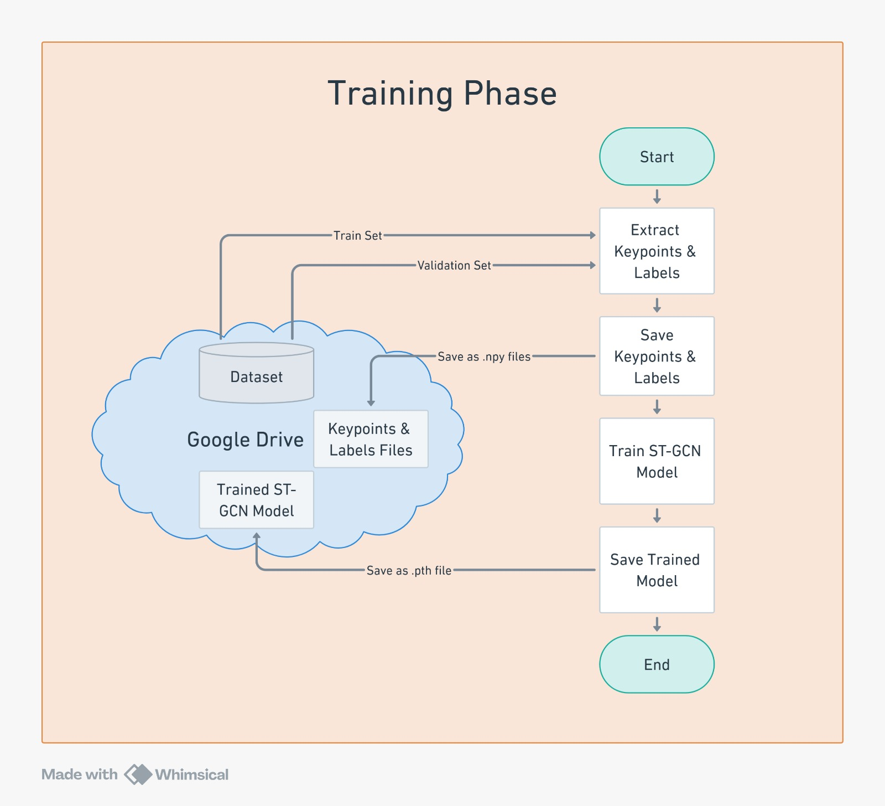
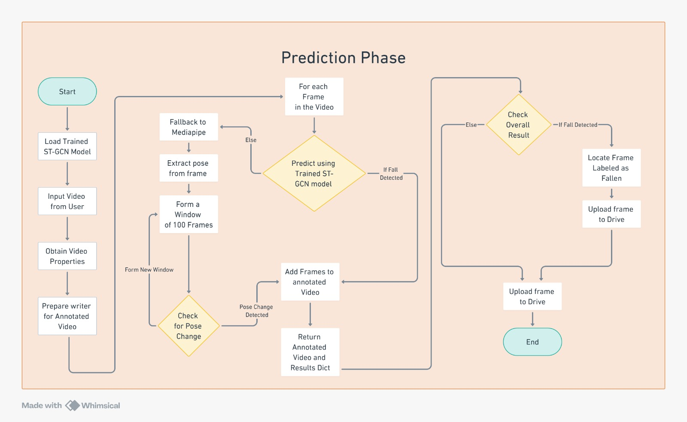

# **Fall Detection System Using MediaPipe and ST-GCN**

## **Project Overview**
This project implements a fall detection system using **MediaPipe Pose** for keypoint extraction and **ST-GCN (Spatio-Temporal Graph Convolutional Network)** for analyzing human pose keypoints. The system detects falls in videos and sends notifications to caregivers using Twilio while uploading fall-detected frames to Google Drive.

---

## **Technologies Used**

1. **MediaPipe**: Extracts 33 pose keypoints per frame for fall detection.
2. **ST-GCN**: Spatio-Temporal Graph Convolutional Network for classifying frames as:
   - **Falling**
   - **Not Falling**
3. **Twilio API**: Sends SMS notifications with fall alerts and Google Drive links.
4. **Google Drive API**: Uploads fall-detected frames for easy access.
5. **Python**: Main programming language for development.
6. **Google Colab**: Used for model training, testing, and deployment.

---

## **Pipeline**

1. **Input Video**: User uploads a video for analysis.
2. **Pose Extraction**:
   - **ST-GCN Phase**: Uses the trained **ST-GCN model** to classify video frames as:
     - **Falling**
     - **Not Falling**
   - **Fallback to MediaPipe**: If ST-GCN detects a fall or encounters errors, MediaPipe is used to extract pose keypoints for further analysis.
3. **Sliding Window Logic**:
   - Applies a sliding window of 100 frames to validate fall detection.
   - If a transition from **Sitting** or **Standing** to **Lying** is detected within the window, the video is classified as **Fall Detected**; otherwise, **No Fall Detected**.
4. **Twilio Integration**:
   - Sends alerts if a fall is detected.
   - Uploads the detected fall frame to Google Drive and provides a shareable link.

---

## Fall Detection Model - Flowchart Diagrams

### 1. Training Phase Flowchart
The training phase involves processing labeled frame data, extracting keypoints, and training the STGCN model to detect falls. Below is the flowchart for the training phase:



### 2. Prediction Phase Flowchart
Once the model is trained, it can be used to predict falls in new video data. The prediction phase involves video frame processing, keypoint extraction, and using the trained model for classification. Below is the flowchart for the prediction phase:



---

## **Functions Used**

### **Key Features**
- **Keypoint Extraction**: Extracts and normalizes pose landmarks using MediaPipe.
- **ST-GCN Training**: Trains the model on labeled pose keypoints to classify falls.
- **Sliding Window Logic**: Validates fall detection over time.
- **Notification System**: Sends SMS with Google Drive links to caregivers when a fall is detected.

Refer to the [codebase file](Fall Detection using Mediapipe+STGCN.md) for details on functions and their usage.

---

## **Links to Resources**
- **Dataset**: [Download the Image Dataset](https://drive.google.com/drive/folders/1ixR5y90RfxJ_PdML1vh-DIF90QMAg74t?usp=sharing)  
- **Colab Notebook**: [Run on Google Colab](https://colab.research.google.com/drive/1E-XdROrjfMnfx2f7ql1KIxQhDeyMKPul?usp=sharing)  
- **Technical Specification Document**: [View Technical Document](https://docs.google.com/document/d/1muyg_PYuDU2s15_Jioph70hL91JaNWQL/edit?usp=sharing&ouid=113415972233706600255&rtpof=true&sd=true)  
- **Logical and Flow Diagrams**: [Download Diagrams](https://github.com/Abhiraman-S-Nair/YOLO-STGCN_Fall_Detection/tree/main/images)

---

## **Setup Instructions**

1. Clone the repository:
   ```bash
   git clone <repo-link>
   cd fall-detection-system
   ```

2. Install required libraries:
   ```bash
   pip install torch torchvision mediapipe opencv-python twilio numpy
   ```

3. Mount Google Drive (for Colab users):
   ```python
   from google.colab import drive
   drive.mount('/content/drive')
   ```

4. Example Execution:
   ```python
   from google.colab import files
   uploaded = files.upload()
   video_path = list(uploaded.keys())[0]
   results = predict_with_fallback(video_path, model, device)
   print(results['Overall Result'])
   ```

---

### **Contributors**
- **Abhiraman S Nair**: Integration, Code Optimization, and Model Implementation  
- **Anandhu**: Twilio Integration R&D  
- **Anns George**: ST-GCN Model R&D  
- **Chinnu Abbey**: ST-GCN Model R&D  
- **Hanna Elza John**: Twilio Integration R&D  
- **Kevin C Mathews**: MediaPipe R&D  
- **Krishnapriya C**: ST-GCN Model R&D  
- **Navaneeth C P**: MediaPipe R&D  
- **Nidhin Biju**: MediaPipe R&D  
- **Sivani Binu**: Twilio Integration R&D
  
